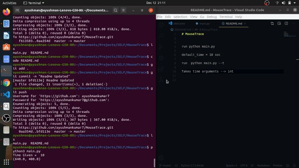

# MouseTrace

### Clone
> Clone the Repo First

```shell 
$ git clone https://github.com/ayushmankumar7/MouseTrace.git
```
### Run 
> Run Python File 
```shell
$ python main.py
```

> Run with "time" argument-  '--t'

```shell
$ python main.py --t 15

```
Script runs for 15 secs. 
! Argument takes 'int' values 
default_time = 10 sec 
 




